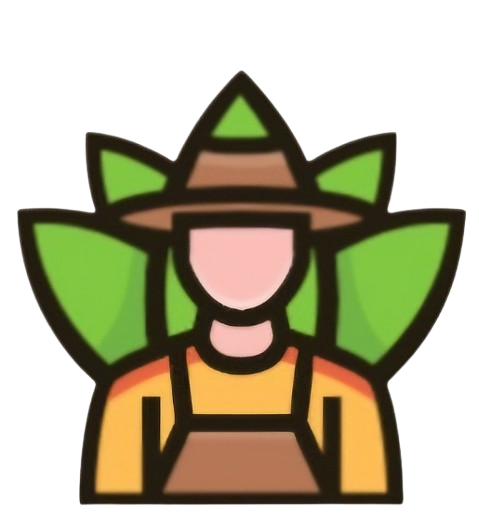

#   
# 🚜 Lencho – Smart Farming Companion  
**Version:** `v1.0.0-beta`

Lencho is a modern farming assistant app built for farmers and agricultural enthusiasts. Whether you're managing crops, checking the weather, or staying updated with the latest agricultural trends, Lencho is here to support your journey. 🌾

---

## 🌟 Features

- **📰 Agricultural News**  
  Get real-time updates on market prices, farming trends, and techniques.

- **🌡️ Weather Integration**  
  Stay informed with up-to-date weather forecasts tailored for farming activities.

- **💧 Irrigation Planner**  
  Optimize water usage with smart irrigation scheduling based on weather and crop needs.

- **🦠 Disease Detection (AI-Powered)**  
  Detect crop diseases using image analysis and receive recommendations for treatment.

- **📢 Campaigns & Job Listings**  
  Explore farming campaigns, community events, and job opportunities in the agri-sector.

---

## 📦 Installation

1. Head to the [Releases Page](https://github.com/orange-carpet-org/lencho/releases).
2. Download the latest version of **Lencho**.
3. Install and launch the app.
4. Start managing your farm like a pro! 🚜🌱

---

## 🛠 Tech Stack

- Flutter (UI)
- Firebase (Backend & Auth)
- TensorFlow Lite (Disease Detection)
- OpenWeather API (Weather Integration)
- News API (Agricultural News)

---

## 🌐 Related Repositories

- 🔌 [Lencho Server (API + Backend)](https://github.com/orange-carpet-org/lencho-server)

---

## 💬 Feedback & Support

We’d love to hear from you!  
- Found a bug? Have an idea? [Open an issue](https://github.com/orange-carpet-org/lencho/issues) on GitHub.  
- Reach out to our team for support or suggestions.

---

## 🙌 Contributing

Contributions are welcome! If you'd like to help improve Lencho, feel free to fork the repo and submit a pull request.

---

## 📄 License

This project is licensed under the [MIT License](LICENSE).

---

**Happy farming with Lencho! 🌾🚜**
